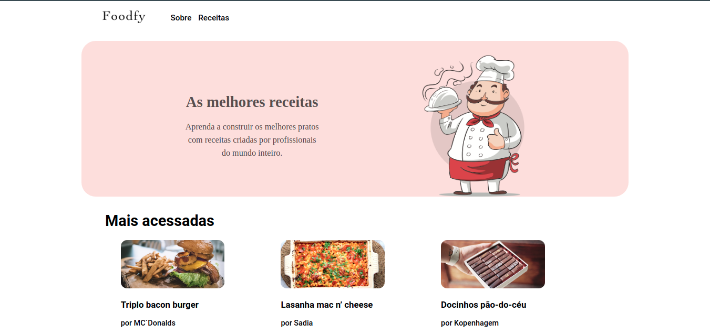

<h1 align="center">Foodfy</h1>

<p align="center"></p>

## Sobre o projeto

Foodfy é um site de receitas, onde você poderá aprender a fazer receitas e postar suas próprias receitas lá.

<p align="center">
    
</p>

## Tecnologias

* Html5
* Css3
* JavaScript
* NodeJs (express, nodemon, browsersync, method-override)
* Nunjucks
* PostgreSQL

## Todo List

Tarefas para terminar:

- [x] Fazer página principal.
- [x] Fazer página sobre.
- [x] Criar receitas.
- [x] Ver receitas.
- [x] Editar receitas.
- [x] Deletar receitas
- [x] Refatorar projeto.
- [x] Armazenar receitas no banco de dados.
- [x] Refatorar a parte de editar e deletar receitas.
- [ ] Criação de chefs.
- [ ] Filtro de receitas.

## 👷 Instalação

Para rodar o projeto, você precisa do [Node.Js] e o [PostgreSQL] instalado em sua máquina.

Clonando projeto em sua máquina:

Com SSH
```bash
git clone git@github.com:jpbrab0/Foodfy.git
```

Com Https
```bash
git clone https://github.com/jpbrab0/Foodfy.git
```

Ápos a instalação entre no diretório do projeto e rode:
```bash
npm install
```

Criando database:

No postbird ou outro app para gerenciar o banco de dados, crie um database chamado `foodfy` e depois rode:

```sql
CREATE TABLE "recipes" (
  "id" SERIAL PRIMARY KEY,
  "image_url" text NOT NULL,
  "title" text NOT NULL,
  "author" text NOT NULL,
  "ingredients" text[] NOT NULL,
  "prepare" text[] NOT NULL,
  "informations" text
)
```
Para criar a tabela de receitas.

## 🚀 Rodando projeto

Com npm
```bash
npm start
```

Com yarn
```bash
yarn start
```

**Feito por [João Pedro Resende](https://jpres.dev)**